# WIP

# Base de Datos

## Sprint 1


# Creación del Script Inicial 
Creación de un Script Incial a partir de los diagramas de Entidad y Relacional.

```mysql
Drop schema if exists ElSantuarioDelBuenGusto;
Create schema if not exists ElSantuarioDelBuenGusto;
use ElSantuarioDelBuenGusto;
```
#### Tabla Clientes
Clientes: Clientes del restaurante.
```mysql
create table Clientes (
ID_Cliente int primary key auto_increment,
Nombre Varchar(155) not null,
Telefono int Unique,
Correo_Electronico Varchar(155) not null,
Alergias Varchar(255) null
);
```
#### Tabla Cocineros
Cocineros: Específico para el personal que cocina los platos. Cada cocinero cocina un plato.
```mysql
create table Cocineros (
ID_Cocinero int primary key auto_increment,
Nombre Varchar(155) not null,
Turno_Trabajo enum('Morning', 'Afternon'),  #Mañana  Tarde
Fecha_contratacion Date not null,
Experiencia Varchar(155) not null
);
```
#### Tabla Camareros
Camareros: Específico para el personal que atiende a los clientes. Cada camarero puede atender múltiples mesas.
```mysql
create table Camareros (
ID_Camareros int primary key auto_increment,
Nombre varchar(155) not null,
Turno_Trabajo enum('Morning', 'Afternon'),
Fecha_Contratacion Date not null,
Experiencia varchar(155) null
);
```
#### Tabla Mesas
Mesas (TAULA): Cada mesa es atendida por un único camarero a la vez, pero puede tener varias comandas a lo largo del día.
```mysql
create table Mesas(
ID_Mesa int primary key auto_increment,
Camarero_ID int,
Comandas int not null,
Capacidad Varchar(155) not null,
Estado enum('Disponible', 'Ocupado', 'Reservado'),
constraint fk_Mesas_Camareros foreign key (Camarero_ID) references Camareros (ID_Camareros) ON delete SET NULL ON UPDATE CASCADE
);
```
#### Tabla Comandas
Comandas: Cada comanda está asociada a una mesa y contiene múltiples platos. Se debe registrar la hora de la comanda.
```mysql
create table Comandas (
ID_Comanda int primary key auto_increment,
ID_MesaComanda int default null,
Platos varchar(155) not null,
Hora_Comanda Time not null,
Estado enum('Pendiente', 'En preparacion', 'Finalizado'),
constraint fk_Comandas_Mesas foreign key (ID_MesaComanda) references Mesas (ID_Mesa) ON delete SET NULL ON UPDATE CASCADE
);
```
#### Tabla Usuarios
Usuarios (USU): Representa tanto a los clientes como al personal del restaurante. Cada usuario tiene un identificador único.
```mysql
create table Usuarios (
ID_Usuario int primary key auto_increment,
Cliente_ID int,
Camarero_ID int,
Cocinero_ID int,
constraint fk_Usuario_Camarero foreign key (Camarero_ID) references Camareros (ID_Camareros) ON delete SET NULL ON UPDATE CASCADE,
constraint fk_Usuario_Cliente foreign key (Cliente_ID) references Clientes (ID_Cliente)  ON delete SET NULL ON UPDATE CASCADE,
constraint fk_Usuario_Cocinero foreign key (Cocinero_ID) references Cocineros (ID_Cocinero) ON delete SET NULL ON UPDATE CASCADE
);
```
#### Tabla Platos
Platos (PLAT): Cada plato pertenece a un menú y se prepara utilizando diversos productos del stock. Un plato puede aparecer en múltiples comandas.
```mysql
create table Platos (
ID_Platos int primary key auto_increment,
ID_Cocinero int,
Nombre varchar(155) not null,
Descripcion varchar(255) not null,
Precio decimal(10,2) not null,
Tipo enum('Primer Plato', 'Segundo Plato'),
constraint fk_CocineroPlatos foreign key (ID_Cocinero) references Cocineros (ID_Cocinero) ON delete SET NULL ON UPDATE CASCADE
);
```
#### Tabla Productos
Productos (PRODUCTE): Cada vez que se ordena un plato, los productos correspondientes se deducen del stock.
```mysql
create table Productos (
ID_Productos int primary key auto_increment,
Stock int not null,
Nombre varchar(155) not null
);
```
#### Tabla intermedia PlatosProducto
PlatosProducto: Tabla intermedia para la unión de las relaciones entre platos y productos.
```mysql
create table PlatosProducto (
ID_Platos int,
ID_Productos int,
primary key (ID_Platos, ID_Productos),
constraint fk_Platos_Producto foreign key (ID_Platos) references Platos (ID_Platos) ON delete RESTRICT  ON UPDATE CASCADE,
constraint fk_Productos foreign key (ID_Productos) references Productos (ID_Productos) ON delete RESTRICT ON UPDATE CASCADE
);
```
#### Tabla Menus
Menús (MENU): Los menús están compuestos por varios platos.
```mysql
create table Menus (
ID_Menu int primary key auto_increment,
NombresPlato varchar(155) default null,
Descripcion Varchar(155) default null,
PrecioTotal decimal(10,2) default null,
ImagenMenu varchar(255)
);
```
#### Tabla intermedia PlatosComandas
PlatosComandas: Tabla intermedia para la unión de las relaciones entre platos, menu y comandas.
```mysql
create table PlatosComandas (
ID_Plato int,
ID_Comanda int,
ID_Menu int,
primary key (ID_Plato, ID_Comanda, ID_Menu),
constraint fk_Platos foreign key (ID_Plato) references Platos (ID_Platos) ON delete RESTRICT ON UPDATE CASCADE,
constraint fk_Comanda foreign key (ID_Comanda) references Comandas (ID_Comanda) ON delete RESTRICT ON UPDATE CASCADE,
constraint fk_MenuComanda foreign key (ID_Menu) references Menus (ID_Menu) ON delete RESTRICT ON UPDATE CASCADE
);
```
#### Tabla intermedia MenuPlato
MenuPlato: Tabla intermedia para la unión de las relaciones entre menu y platos.
```mysql
create table MenuPlato (
ID_Menus int,
ID_Platos int,
primary key (ID_Menus, ID_Platos),
constraint fk_Menus foreign key (ID_Menus) references Menus (ID_Menu) ON delete RESTRICT ON UPDATE CASCADE,
constraint fk_PlatosMenu foreign key (ID_Platos) references Platos (ID_Platos) ON delete RESTRICT ON UPDATE CASCADE
);
```

## Sprint 2

### Creación de Funciones

La primera función recibe un menu, le aplica un descuento del 5% y lo devuelve con descuento.
``` mysql
DELIMITER //

CREATE FUNCTION CalcularTotalMenuConDescuento (p_id_menu INT)
RETURNS DECIMAL(10,2) DETERMINISTIC
BEGIN
    DECLARE v_total DECIMAL(10,2);
    DECLARE v_descuento DECIMAL(10,2);
    
    SELECT SUM(p.Precio)
    INTO v_total
    FROM Platos p
    INNER JOIN MenuPlato mp ON p.ID_Platos = mp.ID_Platos
    WHERE mp.ID_Menus = p_id_menu;
    
    SET v_descuento = v_total * 0.05;
    SET v_total = v_total - v_descuento;    
    RETURN v_total;
END; // 
DELIMITER ;
```
La segunda función recibe una de dos opciones, Mañana o Tarde y calcula cuantos camareros hay disponibles en ese turno.
``` mysql 
DELIMITER //
CREATE FUNCTION VerificarDisponibilidadCamarerosPorTurno (p_turno ENUM('Mañana', 'Tarde'))
RETURNS INT DETERMINISTIC
BEGIN
    DECLARE v_cantidad INT;
    SELECT COUNT(*)
    INTO v_cantidad
    FROM Camareros
    WHERE Turno_Trabajo = p_turno;
    RETURN v_cantidad;
END; //
DELIMITER ;
```
La tercera función recibe un menu y devuelve los platos que lo componen por separado.
``` mysql 
DELIMITER //
CREATE FUNCTION ObtenerPlatosDeMenu (p_id_menu INT)
RETURNS VARCHAR(255) DETERMINISTIC
BEGIN
    DECLARE v_platos VARCHAR(255);
    SELECT GROUP_CONCAT(p.Nombre SEPARATOR ', ')
    INTO v_platos
    FROM Platos p
    INNER JOIN MenuPlato mp ON p.ID_Platos = mp.ID_Platos
    WHERE mp.ID_Menus = p_id_menu;
    RETURN v_platos;
END; //
DELIMITER ;
```
La cuarta función calcula el promedio de comandas que hay en total entre toda las mesas que hay en el restaurante
``` mysql 
DELIMITER //
CREATE FUNCTION CalcularPromedioComandasPorMesa ()
RETURNS DECIMAL(10,2) DETERMINISTIC
BEGIN
    DECLARE v_promedio DECIMAL(10,2);
    SELECT AVG(Comandas)
    INTO v_promedio
    FROM Mesas;
    RETURN v_promedio;
END; //
DELIMITER ;
```
La quinta y última función calcula el promedio de precio de platos que hay por cocinero.
``` mysql 
DELIMITER //
CREATE FUNCTION CalcularPrecioPromedioPlatosPorCocinero (p_id_cocinero INT)
RETURNS DECIMAL(10,2) DETERMINISTIC
BEGIN
    DECLARE v_precio_promedio DECIMAL(10,2);
    SELECT AVG(Precio)
    INTO v_precio_promedio
    FROM Platos
    WHERE ID_Cocinero = p_id_cocinero;
    RETURN v_precio_promedio;
END; //
DELIMITER ;
```

## Sprint 3 

### Creación de Procedures
Procedimiento almacenado para agregar un nuevo cliente.
``` mysql
DELIMITER //
CREATE PROCEDURE AgregarCliente (IN p_nombre VARCHAR(155), IN p_telefono INT, IN p_correo VARCHAR(155), IN p_alergias VARCHAR(255))
BEGIN
    INSERT INTO Clientes (Nombre, Telefono, Correo_Electronico, Alergias)
    VALUES (p_nombre, p_telefono, p_correo, p_alergias);
END //
DELIMITER ;

call AgregarCliente();
```
Procedimiento almacenado para actualizar el estado de una mesa.
``` mysql
DELIMITER //
CREATE PROCEDURE ActualizarEstadoMesa (IN p_id_mesa INT, IN p_estado ENUM('Disponible', 'Ocupado', 'Reservado'))
BEGIN
    UPDATE Mesas SET Estado = p_estado WHERE ID_Mesa = p_id_mesa;
END //
DELIMITER ;

call ActualizarEstadoMesa(1, 1);
select * from Mesas;
```
Procedimiento almacenado para buscar cliente por su ID
``` mysql
DELIMITER //
CREATE PROCEDURE BuscarClientePorID (IN p_id_cliente INT)
BEGIN
    SELECT * FROM Clientes WHERE ID_Cliente = p_id_cliente;
END //
DELIMITER ;

call BuscarClientePorID();
```
Procedimiento almacenado para actualizar el estado de una comanda.
``` mysql
DELIMITER //
CREATE PROCEDURE ActualizarEstadoComanda (IN p_id_comanda INT, IN p_estado ENUM('Pendiente', 'En preparacion', 'Finalizado'))
BEGIN
    UPDATE Comandas SET Estado = p_estado WHERE ID_Comanda = p_id_comanda;
END //
DELIMITER ;
```
Procedimiento almacenado para agregar productos nuevos.
``` mysql
DELIMITER //
CREATE PROCEDURE AgregarProducto (IN p_nombre VARCHAR(155), IN p_stock INT)
BEGIN
    INSERT INTO Productos (Nombre, Stock) VALUES (p_nombre, p_stock);
END //
DELIMITER ;

call AgregarProducto();
```
Procedimiento almacenado para eliminar un cliente de la base de datos por el ID
``` mysql
DELIMITER //
CREATE PROCEDURE EliminarClientePorID (IN p_id_cliente INT)
BEGIN
    DELETE FROM Clientes WHERE ID_Cliente = p_id_cliente;
END //
DELIMITER ;
```

Procedimiento almacenado para poder actualizar el precio de un plato del restaurante.
``` mysql
DELIMITER //
CREATE PROCEDURE ActualizarPrecioPlato (IN p_id_plato INT, IN p_precio DECIMAL(10,2))
BEGIN
    UPDATE Platos SET Precio = p_precio WHERE ID_Platos = p_id_plato;
END //
DELIMITER ;
```

### Creación de Usuarios (DCL)

#### Usuario de Cocinero
Solo tiene permisos de visualizar en su tabla y en productos. Mientras que tiene permisos de modificar en Platos y Menus, que como són ellos quienes los hacen tienen la potestad e cambiar el plato y el menu.
``` mysql
create user 'Cocineros'@'localhost' identified by '123456';

grant select (Nombre, Turno_Trabajo) on Cocineros to 'Cocineros'@'localhost';
grant select, update (Nombre, Descripcion, Tipo) on Platos to 'Cocineros'@'localhost';
grant select, update (NombresPlato, Descripcion) on Menus to 'Cocineros'@'localhost';
grant select (Nombre, Stock) on Productos to 'Cocineros'@'localhost';
```

#### Usuario de Camarero
Solo tiene permisos de visualizar en su tabla. Mientras que tiene los permisos de crear, actualizar, visualizar y borrar Comandas. Además puede crear, actualizar y visualizar clientes.
``` mysql
create user 'Camareros'@'localhost' identified by '654321';

grant select (Nombre, Turno_Trabajo, NumMesa) on Camareros to 'Camareros'@'localhost';
grant select, insert, update on Clientes to 'Camareros'@'localhost';
grant select, update, insert, delete on Comandas to 'Camareros'@'localhost';
```

#### Usuario del Gerente del Restaurante
El gerente tiene todos los permisos en todas las tablas, pues es ha de poder controlar todo, en otras palabras, es un super usuario.
``` mysql
create user 'GerenteRestaurante'@'localhost' identified by '123456';

grant all privileges on ElSantuarioDelBuenGusto to 'GerenteRestaurante'@'localhost';
```

## Proyecto 2

### Actividades MongoDB

#### Activiadad 1
1. Crea una nueva base de datos llamada activi1.

2. Crea una colección llamada estudiantes sin insertar datos.

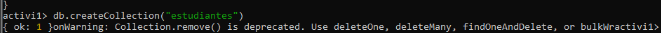

3. Inserta los siguientes datos y asigna el tipo de datos más adecuado:


    * Nombre: María
    * Edad: 27
    * Estudiante: True
    * Asignaturas: [BBDD, Java, Php]
    * Fecha nacimiento: 17/05/1993

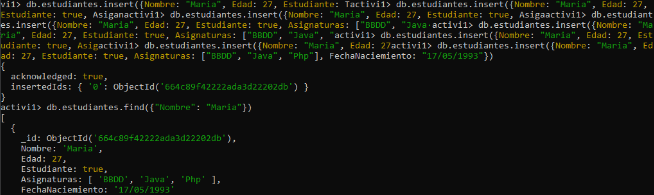

#### Activiadad 2
Partiendo de la Actividad 1:

1. Actualiza la edad de María, aumenta un año.

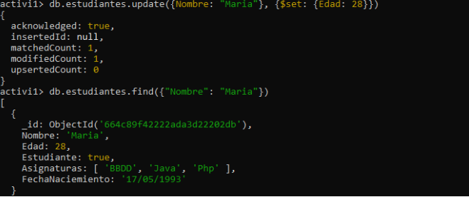

2. Añade la asignatura de ```Ux``` a la lista de asignaturas.

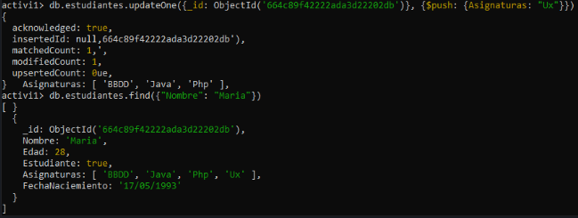

3. Cambia el True de ```estudiante``` a False.

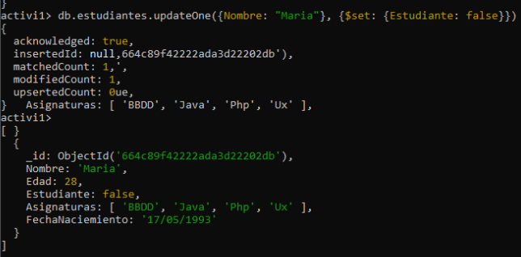

#### Activiadad 3
Partiendo de la Actividad 2:

1. Inserta el estudiante ```Juan``` de ```18``` años (x2 elementos).

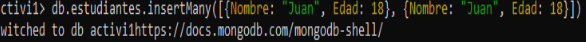

2. Consulta por su nombre para ver que se ha insertado bien.

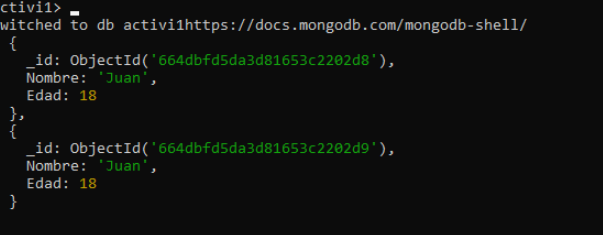

3. Consulta toda la colección para ver si aparece.

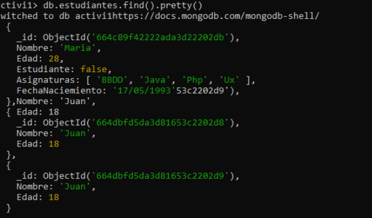

4. Bórralo porque al final no se matricula.

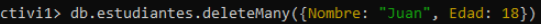

5. Consulta por su nombre para ver que se ha insertado bien.

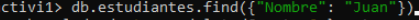

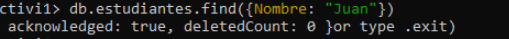

6. Consulta toda la colección para ver si aparece.

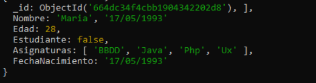

#### Activiadad 4
Partiendo de la Actividad 3:

1. Inserta estos valores:
    ```
    "Nombre": "Ramón", "Edad":17, "estudiante":true, "Juegos": ["A","B","C"]
    "Nombre": "Sara", "Edad":18, "estudiante":false, "Juegos": ["P","B","A","S"]
    "Nombre": "Lucía", "Edad":17, "estudiante":true
    "Nombre": "Luis", "Edad":17, "estudiante":true, "Juegos": ["P"]
    "Nombre": "Ana", "Edad":18, "estudiante":false, "Hermanos":2
    "Nombre": "Mario", "Edad":17, "estudiante":false, "Hermanos":3`
    ```

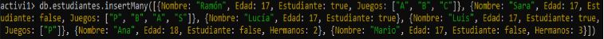

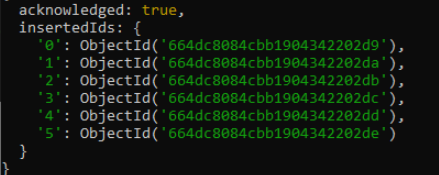

2. Muestra todos los datos

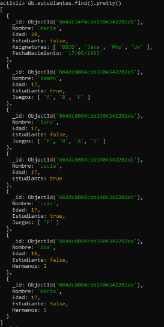

3. Muestra los campos de nombre, edad y Hermanos para todos los datos

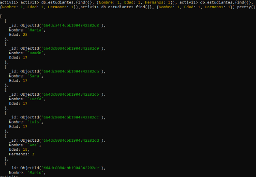

4. Muestra los datos de Lucía

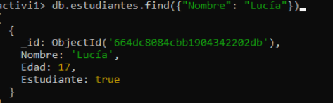

5. Muestra todos los estudiantes (true)

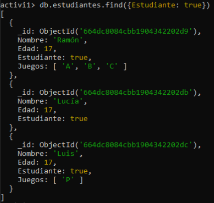

6. Muestra todos los estudiantes que tengan 17 años y sean estudiantes (true)

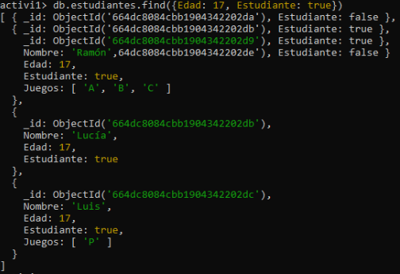

#### Activiadad 5
Partiendo de la Actividad 4:

1. Muestra los estudiantes que tienen 17 años.

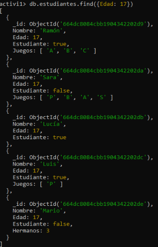

2. Muestra los estudiantes que no tienen 17 años

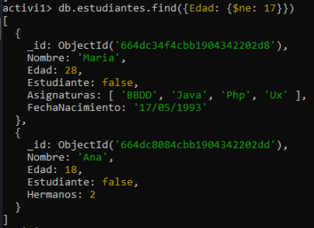

3. Muestra los estudiantes que tengan ````estudiante````= True o tengan 17 años.

3. Muestra los estudiantes que tengan ````estudiante````= True o tengan 17 años.
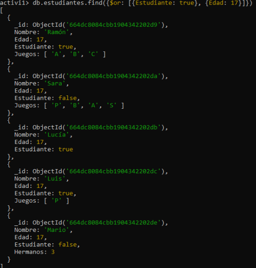

4. Muestra los estudiantes que tengan mas de 17 años.

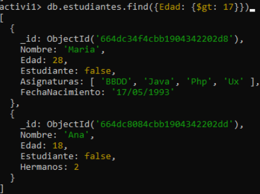

5. Muestra los estudiantes que tengan entre 16 y 20 años.

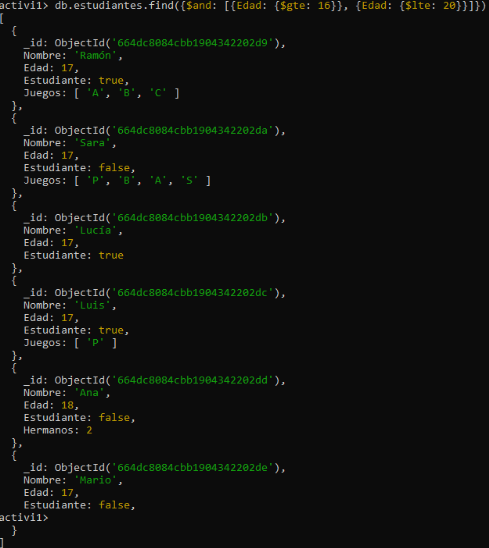

6. Muestra los estudiantes que tengan los juegos ```A```, ```B``` y ```S```.

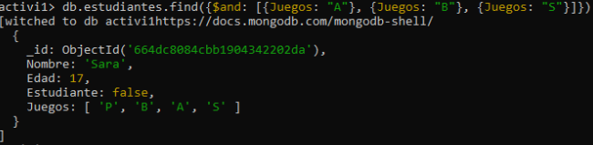

7. Muestra los estudiantes que tengan todos los juegos ```A``` y ```B```.

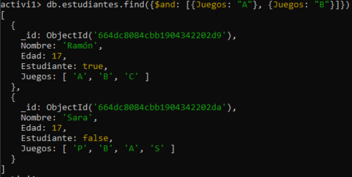

8. Muestra los estudiantes que tengan informados el elemento ```Hermanos```.

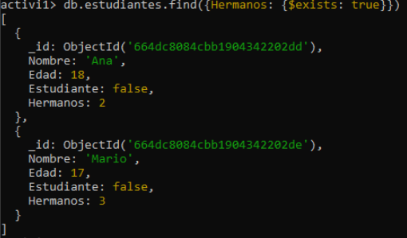

#### Activiadad 6

Partiendo de la Actividad 5:

1. Muestra los estudiantes cuyo nombre empiece por M.

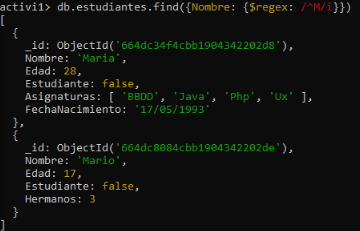

2. Muestra los estudiantes cuyo nombre contenga una a.

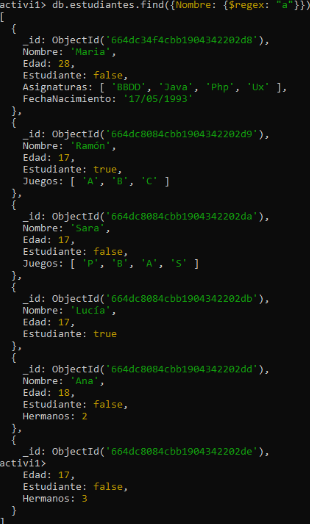

3. Muestra los estudiantes ordenados por el nombre.

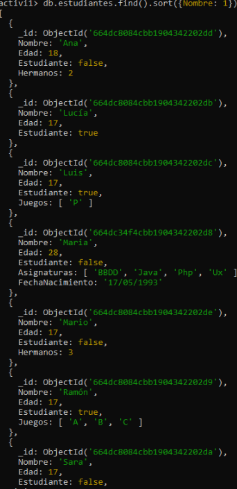

4. Muestra cuántos estudiantes hay en la colección.

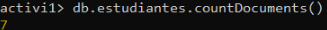

5. Muestra cuántas edades diferentes hay en la colección.

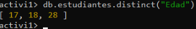

## MongoDB:

Una imagen de como a quedado la Base de Datos de MongoDB, con las colecciones de Proveedores, Tickets y Productos.
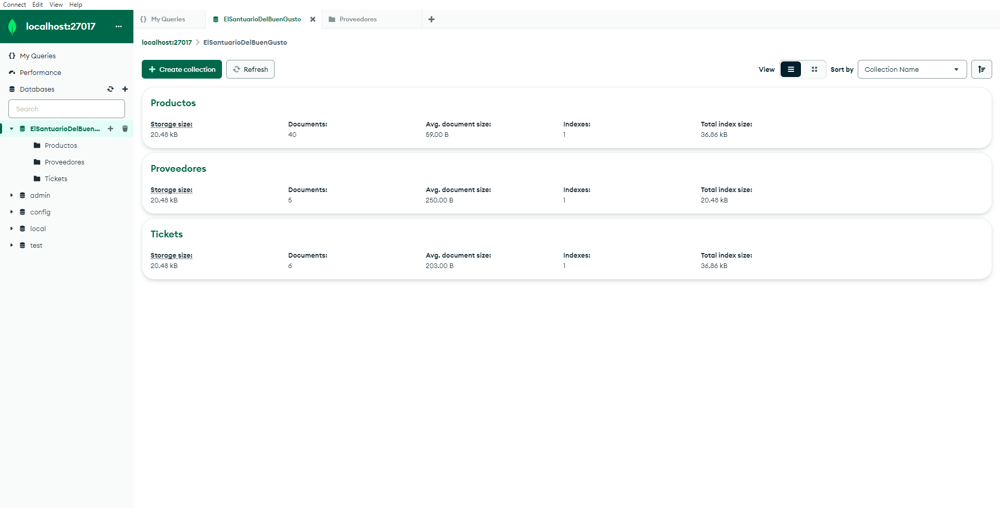