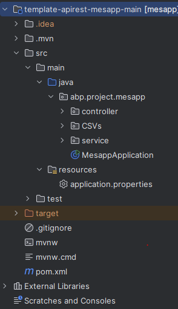

# Apartado de JAVA

## Sprint 2:
### Implementación de las tablas a clases de Java.

Ejemplo de la tabla Camareros.
``` mysql 
create table Camareros (
    ID_Camareros int primary key auto_increment,
    Nombre varchar(155) not null,
    Turno_Trabajo enum('Morning', 'Afternon'),
    Fecha_Contratacion Date not null,
    Experiencia varchar(155) null
);
```

Convertida en la Clase Camareros.
``` JAVA 
private int idCamareros;
	private String turnoTrabajo;
	private String fechaContratacion;
	private String experiencia;
```
### Creación de la clase DDBBConections para la conexión de java con la Base de Datos

Creación de Strings constates para a la hora de establecer una conexión con la base de datos poder logearnos. En este caso en la imagen se ve que inciamos sesión como administrador.

El metodo _**obtenerConexion()**_ detecta si hay una conexión anteriormente, si la hay la devuelve, si no, la crea y la devuelve, por el contrario, si no es capaz de crear la conexión dara error.

El metodo _**cerrarConexion()**_ cerrara la conexión.

``` JAVA 
public class DDBBConections {

	public static final String USER = "root";
	public static final String PASS = "my-secret-pw";
	public static final String SCHEMA = "ElSantuarioDelBuenGusto";
	public static final String BBDD = "jdbc:mysql://localhost:3307/";
	public static final String PARAMS = "?useUnicode=true&characterEncoding=utf8";

	private static DDBBConections instancia;
	private Connection conn;

	DDBBConections() throws SQLException {
		conn = DriverManager.getConnection(BBDD + SCHEMA + PARAMS, USER, PASS);
	}
	
	public Connection obtenerConexion() {
		if(conn != null) {//
			try {
				cerrarConexion();
			} catch (SQLException e) {
				System.out.println("¡Error en la conexion con la base de datos! " +  e.getMessage());
			}
		}try {
			conn = DriverManager.getConnection(BBDD + SCHEMA + PARAMS, USER, PASS);
		} catch (SQLException e) {
			System.out.println("¡Error en la conexion con la base de datos! " +  e.getMessage());
		}
		return conn;
	}

	public static DDBBConections obtenerInstancia() throws SQLException {
		if (instancia == null) {
			instancia = new DDBBConections();
		}
		return instancia;
	}
	
	public void cerrarConexion() throws SQLException {
		conn.close();
	}
}
```
``` JAVA 
	private DDBBConections conn; // Como se Invoca en otras classes.
```
### Aplicación de los setters y getters de cada clase.
``` JAVA 
public int getIdCamareros() {
		return idCamareros;
	}

	public void setIdCamareros(int idCamareros) {
		this.idCamareros = idCamareros;
	}

	public String getTurnoTrabajo() {
		return turnoTrabajo;
	}

	public void setTurnoTrabajo(String turnoTrabajo) {
		this.turnoTrabajo = turnoTrabajo;
	}

	public String getFechaContratacion() {
		return fechaContratacion;
	}

	public void setFechaContratacion(String fechacontratacion) {
		this.fechaContratacion = fechacontratacion;
	}

	public String getExperiencia() {
		return experiencia;
	}

	public void setExperiencia(String experiencia) {
		this.experiencia = experiencia;
	}
```
### Implementación de las consultas de cada clase.
Ejemplo de consultas en Camareros
``` JAVA 
	private static final String SELECT_ALL =
			"Select * from Camareros";

	private static final String INSERT_CAMARERO =
			"Insert into Camareros (Nombre,Turno_Trabajo,Fecha_Contratacion,Experiencia) values (?,?,?,?)";

	public static final String UPDATE_TURNOTRABAJO_CAMARERO =
			"UPDATE Camareros set Turno_Trabajo = ? where ID_Camareros = ?";

	private static final String DELETE_CAMARERO =
			"DELETE FROM Camareros where ID_Camareros = ?";
```

### Ejemplos de Selects:
Logica dentro de los Selects:
1. Se crea la conexión con la base de datos y se inserta el comando a ejecutar en MYSQL (en este caso un Selects).

2. Se ejecuta el comando en la base.

3. Se crea la clase y se guarda en un arrayList.

4. Se cierra la conexión para evitar llegar al limite de conexiones.

En este caso todas las clases tienen la misma logica, sin excepción:
``` JAVA 
	public ArrayList<Camareros> selectAll(ArrayList<Camareros> camareros) throws SQLException {
		conn = new DDBBConections();
		PreparedStatement ps = conn.obtenerConexion().prepareStatement(SELECT_ALL);
		Camareros camarero;

		ResultSet rs = ps.executeQuery();
		while(rs.next()) {
			camarero = new Camareros (rs.getString(2),rs.getString(3),rs.getString(4),rs.getString(5),rs.getInt(1));
			camareros.add(camarero);
		}
		return camareros;
	}
```

### Ejemplos de Inserts:
Logica dentro de los Inserts:
1. Se crea la conexión con la base de datos y se inserta el comando a ejecutar en MYSQL (en este caso un insert).
2. Se rellenean los campos del insert mediante el uso de getters.

3. Se ejecuta el comando en la base.

4. Se cierra la conexión para evitar llegar al limite de conexiones.

Ejemplo en la clase de Camareros:
``` JAVA 
	public void insert(String name, String turnoTrabajo, String fechaContratacion, String experiencia) throws SQLException {
		conn = new DDBBConections();
		PreparedStatement ps = conn.obtenerConexion().prepareStatement(INSERT_CAMARERO);


		ps.setString(1,turnoTrabajo);
		ps.setString(2,turnoTrabajo);
		ps.setString(3,fechaContratacion);
		ps.setString(4,experiencia);

		System.out.println(ps.toString());
		int result = ps.executeUpdate();

		if(result == 0) {
			System.out.println("ERROR: No hay nada que insertar");
		}
	}
```
### Ejemplos de Updates:
Logica dentro de los Updates:

1. Se crea la conexión con la base de datos y se inserta el comando a ejecutar en MYSQL (en este caso un update).

2. Se rellenean los campos del update mediante el uso de getters, usando el id para indicar que dato actualizar.

3. Se ejecuta el comando en la base.

4. Se cierra la conexión para evitar llegar al limite de conexiones.

Ejemplo en la clase de Camareros:
``` JAVA 
	public void updateTurnoTrabajo(String newTurnoTrabajo) throws SQLException {
		conn = new DDBBConections();
		PreparedStatement ps = conn.obtenerConexion().prepareStatement(UPDATE_TURNOTRABAJO_CAMARERO);

		ps.setString(1,newTurnoTrabajo);
		ps.setInt(2,getIdCamareros());

		System.out.println(ps.toString());
		int result = ps.executeUpdate();

		if(result == 0) {
			System.out.println("ERROR: No hay nada que actualizar");
		}
	}
```

Ejemplo en la clase de Platos:
``` JAVA 
	public void updatePrecio(double newPrecio) throws SQLException {
		conn = new DDBBConections();
		PreparedStatement ps = conn.obtenerConexion().prepareStatement(UPDATE_PRECIO_PLATOS);

		ps.setDouble(1, newPrecio);
		ps.setInt(2, getIdPlato());

		System.out.println(ps.toString());
		int result = ps.executeUpdate();

		if (result == 0) {
			System.out.println("ERROR: No hay nada que actualizar");
		}
		closeConection();
	}
```
### Ejemplos de Deletes:
Logica dentro de los Deletes:

1. Se crea la conexión con la base de datos y se inserta el comando a ejecutar en MYSQL (en este caso un Delete).

2. Se rellenean los campos del Delte, usando el campo id para indicar que datos eliminar, en caso de afectar una Foreign key, esta se elimina anteriormente.

3. Se ejecuta el comando en la base.

4. Se cierra la conexión para evitar llegar al limite de conexiones.

Ejemplo en la clase de Camareros:

``` JAVA 
	public void delete() throws SQLException {
		conn = new DDBBConections();
		PreparedStatement ps = conn.obtenerConexion().prepareStatement(DELETE_CAMARERO);
		ps.setInt(1,getIdCamareros());

		System.out.println(ps.toString());
		int result = ps.executeUpdate();

		if(result == 0) {
			System.out.println("ERROR: No hay nada que eliminar");
		}
	}
```

Ejemplo en la clase de Comandas:
``` JAVA 
	public void delete() throws SQLException {
		conn = new DDBBConections();
		deleteIntermediate();
		PreparedStatement ps = conn.obtenerConexion().prepareStatement(DELETE_COMANDAS);
		ps.setInt(1, getIdComandas());

		System.out.println(ps.toString());
		int result = ps.executeUpdate();

		if (result == 0) {
			System.out.println("ERROR: No hay nada que eliminar");
		}
	}

	public void deleteIntermediate() throws SQLException {
		PreparedStatement ps = conn.obtenerConexion().prepareStatement(DELETE_COMANDAS_INTERMEDIATE);

		ps.setInt(1, getIdComandas());

		System.out.println(ps.toString());
		int result = ps.executeUpdate();

		if (result == 0) {
			System.out.println("ERROR: No hay nada que eliminar");
		}
	}
```

### Aplicación de ToString en las Clases:
Uso del @Override para sobrescribir el ToSring de cada clase para que enseñe todos los datos que queramos de las Clases.

Ejemplo en la clase de Camareros:
``` JAVA 
	public String toString(){
		return "El camarero/a " + super.getUsername() + " con el id " + getIdCamareros() + " tiene el horario " + getTurnoTrabajo() + ", se le contrato el " + getFechaContratacion()
				+ " y tiene como experiencia: " + getExperiencia();
	}
```
### Carga de CSVs en la Base de Datos:
Creación de una clase File Manager para cargar los Archivos .CSV / .txt en la base de datos.
La logica creada en este caso fué la siguiente:
1. Creas la clase cuya tabla deseas llenar en la base de datos. 
2. Abres el .CSV / .txt y lo recorres linea a a linea.
3. Lo guardas en un String y lo espliteas para dividir cada parte del String.
4. Por cada linea haces un insert en la base de datos.

Ejemplo de carga de CSV de File Manager de una clase:

``` JAVA
	//INSERT COCINEROS
	public void insertCocinerosBaseDatos(String fileInput) throws SQLException {
		Cocineros cocinero;
		File tabla = new File(fileInput);
		try(FileReader fr = new FileReader(tabla)){
			BufferedReader br = new BufferedReader(fr);
			String line = "";
			line = br.readLine();
			line = br.readLine();
			while(line!=null) {
				String[] fields = splitLine(line);
				cocinero = new Cocineros(fields[1],fields[2],fields[3],fields[4]);
				System.out.println(cocinero);
				cocinero.insert();
				line = br.readLine();
				cocinero.closeConection();
			}
			br.close();

		} catch (FileNotFoundException e) {
			System.out.println("File Not Found: " + e.getMessage());
		} catch (IOException e) {
			System.out.println("Error: " + e.getMessage());
		}
	}
```
Ejemplo de carga de CSV de File Manager de una tabla Intermedia:

``` JAVA
	public static final String INSERT_PLATOSPRODUCTOS = 
			"Insert into PlatosProducto (ID_Platos,ID_Productos) values (?,?)";

	//INSER PLATOS PRODUCTOS
	public void insertPlatosProductoBaseDatos(String fileInput) throws SQLException {
		PreparedStatement ps = conn.obtenerConexion().prepareStatement(INSERT_PLATOSPRODUCTOS);
		File tabla = new File(fileInput);
		int idPlatos = 0, idProductos = 0;
		try(FileReader fr = new FileReader(tabla)){
			BufferedReader br = new BufferedReader(fr);
			String line = "";
			line = br.readLine();
			line = br.readLine();
			while(line!=null) {
				 String[] fields = splitLine(line);
				 idPlatos = Integer.parseInt(fields[0]);
				 idProductos = Integer.parseInt(fields[1]);
				 
					ps.setInt(1,idPlatos);
					ps.setInt(2,idProductos);
					System.out.println(ps.toString());
					int result = ps.executeUpdate();
					
					if(result == 0) {
						System.out.println("ERROR: No hay nada que insertar");
					}
				 line = br.readLine();
			}
			br.close();
			
		} catch (FileNotFoundException e) {
			System.out.println("File Not Found: " + e.getMessage());
		} catch (IOException e) {
			System.out.println("Error: " + e.getMessage());
		}
		System.out.println("Se han guardado perfectamente las uniones de Platos y Productos");
	}
```
## Sprint 3

### Incorporar el código creado a un proyecto esqueleto API

Esta parte consiste principalmente en adaptar el codigo a un esqueleto de una API. Para poder hacer la conexión entre el Fornt-End y el Back-End.




### MessapController
Adaptación de una clase _**MessapController**_ para el procesado de solicitudes del Front-End

#### LOGIN
Recibe un usuario que verificara.
```JAVA 
    @PostMapping("/mesapp/login")
    public ResponseEntity loginUsuarios(@RequestBody Usuarios usuarios) throws SQLException {
        return mesappService.loginUsuarios(usuarios);
    }
```

#### SELECT
Envia un ArrayList de la clase que desea recibir.
```JAVA 
    @GetMapping("/mesapp/getClientes")
    public ResponseEntity getClientes() throws SQLException{
        return mesappService.getClientes();
    }
```

#### INSERT
Recibe la nueva clase a insertar en la Base de Datos.
```JAVA 
    @PostMapping("/mesapp/Camareros")
    public ResponseEntity postCamareros(@RequestBody Camareros camareros) {
        return mesappService.postCamareros( camareros);
    }
```

### UPDATE
Esta clase es más especial, pues el contenido del nuevo campo a actualizar se recibe en un Map que se procesa para convertilo en el tipo de dato a actualizar en la base de datos.
```JAVA 
    @PostMapping("/mesapp/updateStockProductos/{idProductos}")
    public ResponseEntity updateStockProductos(@PathVariable("idProductos") int idProductos,@RequestBody Map<String, Object> request) throws SQLException{
        int stock = (Integer) request.get("stock");
        return mesappService.updateStockProductos(idProductos,stock);
    }
```

#### DELTE
Recibe el ID del dato a eliminar.
```JAVA 
    @DeleteMapping("/mesapp/deleteCamareros/{idCamareros}")
    public ResponseEntity deleteCamareros(@PathVariable("idCamareros") int idCamareros) throws SQLException{
        return mesappService.deleteCamareros(idCamareros);
    }
```

### MessapService
Adaptación de una clase _**MessapService**_ para la gestión de las clases y la base de Datos.

#### SELECT

```JAVA 
       public ResponseEntity getClientes() throws SQLException {
        try {
            Clientes cliente = new Clientes();
            ArrayList<Clientes> listaClientes = new ArrayList<Clientes>();
            listaClientes = cliente.selectAll(listaClientes);

            if (listaClientes.isEmpty()) {
                throw new RestaurantException(RestaurantException.SELECT_ERROR);
            }
            return ResponseEntity.ok().body(listaClientes);
        } catch (Exception e) {
            ResponseEntity.badRequest().body(e.getMessage());
        }
        return ResponseEntity.badRequest().body("");
    }
```

#### INSERT

```JAVA 
       public ResponseEntity postCamareros(Camareros camareros) {
        try {
            camareros.insert();
            //Retornamos la respuesta de OK. Dentro del body() se pueden mandar objetos Java o Mensajes String
            return ResponseEntity.ok().body("");
        } catch (Exception e) {
            //Retornamos el error generado por la excepción Personalizada
            return ResponseEntity.badRequest().body(e.getMessage());
        }
    }
```

#### UPDATE

```JAVA 
       public ResponseEntity updateStockProductos(int idProductos,int stock) throws SQLException {
        try {
            Productos producto = new Productos();
            ArrayList<Productos> listaProductos = new ArrayList<Productos>();
            listaProductos = producto.selectAll(listaProductos);

            for (Productos listaProducto : listaProductos) {
                producto = listaProducto;
                if (producto.getIdProductos() == idProductos) {
                    int oldStock = producto.getStock();
                    producto.setStock(stock);
                    producto.updateStock(stock);
                    if (producto.getStock() == oldStock) {
                        throw new RestaurantException(15);
                    } else {
                        return ResponseEntity.ok().body("");
                    }
                }
            }

        } catch (Exception e) {
            return ResponseEntity.badRequest().body(e.getMessage());
        }
        return ResponseEntity.badRequest().body("");
    }
```

#### DELTE

```JAVA 
    public ResponseEntity deleteCamareros(int idCamareros) throws SQLException {
        try {
            Camareros camarero = new Camareros();
            ArrayList<Camareros> listaCamareros = new ArrayList<Camareros>();
            listaCamareros = camarero.selectAll(listaCamareros);
            for (int i = 0; i < listaCamareros.size(); i++) {
                camarero = listaCamareros.get(i);
                if (camarero.getIdCamareros() == idCamareros) {
                    String nombreCamararero = camarero.getUsername();
                    listaCamareros.remove(camarero);
                    camarero.delete();
                    for (Camareros listaCamarero : listaCamareros) {
                        camarero = listaCamarero;
                        if (camarero.getUsername().compareToIgnoreCase(nombreCamararero) == 0) {
                            throw new RestaurantException(RestaurantException.DELETE_ERROR);
                        }
                    }
                    return ResponseEntity.ok().body("");
                }
            }
        } catch (Exception e) {
            ResponseEntity.badRequest().body(e.getMessage());
        }
        return ResponseEntity.badRequest().body("");
    }
```
### Tratamiento de Excepciones
1. Creación de una clase de Tratamiento de excepciones personalizadas. 
2. Disminunción de bloques Try/Catch
```JAVA
public class RestaurantException extends Exception {

	public static int SELECT_ERROR = 0;
	public static int UPDATE_ERROR = 1;
	public static int DELETE_ERROR = 2;
	public static int INSERT_ERROR = 3;
	public static int ERROR_CREATE_USER = 4;
	public static int ERROR_UPDATE_USER = 5;
	public static int ERROR_CREATE_CHEF = 6;
	.
	.
	.
	public static int ERROR_CREATE_PRODUCT = 18;
	public static int ERROR_UPDATE_PRODUCT = 19;
	public static int LOGIN_ERROR = 20;

	private static String [] Exceptions = {"Error al consultar la Base de Datos, consulte con el tecnico"
			,"Error al actualizar la Base de Datos, consulte con el tecnico"
			,"Error al eliminar en la Base de Datos, consulte con el tecnico"
			,"Error al insertar la Base de Datos, consulte con el tecnico"
			,"Error al crear el cliente, consulte con el tecnico"
			,"Error al modificar el cliente, consulte con el tecnico"
			,"Error al crear el cocinero, consulte con el tecnico"
			,"Error al modificar el cocinero, consulte con el tecnico"
			.
			.
			.
			,"Error al modificar el producto, consulte con el tecnico"
			,"Error al modificar el producto, consulte con el tecnico"
			,"Error en el inicio de Session"};

	private int msg;

	RestaurantException (int msg){setMsg(msg);}

	public int getMsg() {return msg;}

	public void setMsg(int msg) {this.msg = msg;}

	@Override
	public String getMessage() {
		return Exceptions[getMsg()];
	}	
}
```

## Proyecto 2

### Creación de una Clase de Conexión con MongoDB

En este caso fué una clase muy pequeña ya que solamente se usaba para establecer la conexión con MongoDB y cerrar la conexión.

```JAVA
public class DB {
   public MongoClient connectDB(String uri) {
        Logger.getLogger("org.mongodb.driver").setLevel(Level.SEVERE);
        MongoClient mongoClient = null;
        try {
            mongoClient = MongoClients.create(uri);
            System.out.println("Connected");
        } catch (Exception e) {
            System.out.println("Error connecting");
        }
        return mongoClient;
    }

    public void disconnectDB(MongoClient mongoClient) {
        System.out.println("Disconnected");
        mongoClient.close();
    }
}
```

### Creación de una clase Ticket
Metodo para recibir todos los tickets
``` JAVA
public ArrayList<Ticket> getAllTickets(ArrayList<Ticket> ticketslist){
        String mongoDB = "ElSantuarioDelBuenGusto";
        String mongoCollection = "Tickets";
        String uri = "mongodb://localhost:27017/";

        dbMC = new DB();
        MongoClient mc = dbMC.connectDB(uri);
        MongoDatabase database = mc.getDatabase(mongoDB);
        MongoCollection<Document> collection = database.getCollection(mongoCollection);

        FindIterable<Document> iterDoc = collection.find();

        for (Document doc : iterDoc) {
            int order = doc.getInteger("Order");
            int table = doc.getInteger("Table");
            int waiter = doc.getInteger("Waiter");
            String date = doc.getString("Date");
            String numComensales = doc.getString("NumComensales");
            List<String> platos = doc.getList("Platos", String.class);
            double taxes = doc.getDouble("Taxes");
            double total = doc.getDouble("Total");

            Ticket ticket = new Ticket(order,table,waiter,date,numComensales,platos,taxes,total);
            ticketslist.add(ticket);
        }
        dbMC.disconnectDB(mc);
        return ticketslist;
    }
```

Metodo para insertar un nuevo ticket en la Base de Datos.
``` JAVA
  public void insert(){
        String mongoDB = "ElSantuarioDelBuenGusto";
        String mongoCollection = "Tickets";
        String uri = "mongodb://localhost:27017/";

        dbMC = new DB();
        MongoClient mc = dbMC.connectDB(uri);
        MongoDatabase database = mc.getDatabase(mongoDB);
        MongoCollection<Document> collection = database.getCollection(mongoCollection);

        Document doc = new Document("Order", getIdComanda()).append("Table",getMesa()).append("Waiter",getWaiter())
                .append("Date",getDate()).append("numComensales", getNumComensales()).append("Platos", getPlatos()).
                append("Taxes", getTaxes()).append("Total", getPrecioTotal());

        try {
            collection.insertOne(doc);
            System.out.println("Inserción Perfecta");

        } catch (com.mongodb.MongoWriteException e) {
            System.out.println(e.getMessage());
            e.printStackTrace();
        }
        dbMC.disconnectDB(mc);
    }
```
Metodo para eliminar un ticket.

``` JAVA
    public void delete(){
        String mongoDB = "ElSantuarioDelBuenGusto";
        String mongoCollection = "Tickets";
        String uri = "mongodb://localhost:27017/";

        dbMC = new DB();

        MongoClient mc = dbMC.connectDB(uri);
        MongoDatabase database = mc.getDatabase(mongoDB);
        MongoCollection<Document> collection = database.getCollection(mongoCollection);
        Bson filter = Filters.eq("Order", getIdComanda());
        Document doc = collection.find(filter).first();
        DeleteResult dr = null;
        try {
            dr = collection.deleteOne(doc);
        } catch (MongoWriteException e) {
            System.err.println(e.getMessage());
            e.printStackTrace();
        }
    }
```


### Creación de una clase Proveedor

Atrivutos de la Clase:

``` JAVA
    private String nombre;
    private String direccion;
    private String contacto;
    private List<Productos> productos;
    private DB dbMC;
```

Función para recoger todos los proveedores de la base junto con sus productos.

``` JAVA
    public ArrayList<Proveedores> getAllProveedores(ArrayList<Proveedores> productosList){
        String mongoDB = "ElSantuarioDelBuenGusto";
        String mongoCollection = "Proveedores";
        String uri = "mongodb://localhost:27017/";

        dbMC = new DB();
        MongoClient mc = dbMC.connectDB(uri);
        MongoDatabase database = mc.getDatabase(mongoDB);
        MongoCollection<Document> collection = database.getCollection(mongoCollection);

        FindIterable<Document> iterDoc = collection.find();
        Productos producto;
        for (Document doc : iterDoc) {
            String nombre = doc.getString("nombre");
            String direccion = doc.getString("direccion");
            String contacto = doc.getString("contacto");
            List<Productos> productos = new ArrayList<>();
            List<Document> productosDocs = (List<Document>) doc.get("productos");
            for (Document prodDoc : productosDocs) {
                String id = prodDoc.getString("id");
                Double precioUnidad  = prodDoc.getDouble("precio_por_unidad");
                producto = new Productos(id,precioUnidad);
                productos.add(producto);
            }
            Proveedores provedor = new Proveedores(nombre,direccion,contacto,productos);
            productosList.add(provedor);
        }
        dbMC.disconnectDB(mc);
        return productosList;
    }
```

Creación de un metodo Insert para guardar proveedores en caso de crear uno nuevo.

``` JAVA
    public void insert(){
        String mongoDB = "ElSantuarioDelBuenGusto";
        String mongoCollection = "Proveedores";
        String uri = "mongodb://localhost:27017/";

        dbMC = new DB();
        MongoClient mc = dbMC.connectDB(uri);
        MongoDatabase database = mc.getDatabase(mongoDB);
        MongoCollection<Document> collection = database.getCollection(mongoCollection);
        Document doc = new Document("nombre", getNombre()).append("direccion",(getDireccion()))
                .append("contacto",(getContacto())).append("productos",(getProductos()));

        try {
            collection.insertOne(doc);
            System.out.println("Inserción Perfecta");

        } catch (com.mongodb.MongoWriteException e) {
            System.out.println("Hola" + e.getMessage());
            e.printStackTrace();
        }
        dbMC.disconnectDB(mc);
    }

```

### Nuevos metodos en MessappAplication.

En este caso fueron los metodos pertinentes para la creación de nuevos tickets

``` JAVA
public ResponseEntity createTicketComandas(int idComandas) {
	...
	...
	...
	...
	...
}
```

Para la eliminación de tickets, y opertura de comandas cerradas.

``` JAVA
public ResponseEntity deleteTickets(int idComanda) {
    try {
        Ticket ticket = new Ticket();
        ArrayList<Ticket> listatickets = new ArrayList<>();
        listatickets = ticket.getAllTickets(listatickets);
        for (Ticket listaticket : listatickets) {
            ticket = listaticket;
            if (ticket.getIdComanda() == idComanda) {
                ticket.delete();
            }
        }
        Comandas comanda = new Comandas();
        ArrayList<Comandas> listacomandas = new ArrayList<>();
        listacomandas = comanda.selectAll(listacomandas);
        for (Comandas listacomanda : listacomandas) {
            comanda = listacomanda;
            if (comanda.getIdComandas() == idComanda) {
                comanda.setEstado("En preparacion");
                comanda.updateEstado("En preparacion");
            }
        }
        return ResponseEntity.ok().body("");
    } catch (Exception e) {
        return ResponseEntity.badRequest().body(e.getMessage());
    }
}
```
Y para hacer el reestock de el restaurante, además de contar el precio.

``` JAVA
  public ResponseEntity obtaintReestock(String nombre, int numProduct) {
		...
		...
		...
		...
		...
  }
```
