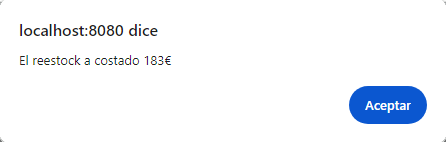

# WIP
# Lenguaje de Marcas

## Sprint 3

### Creación de un VUE
Creación y configuración de un proyecto vue, implementando un router, en este caso también esta implementado bootsrap.

Al entrar en la pagina te dirige directamente a la pantalla home. La cual Cuenta con un Menu, un container con la imagen del logo del Restaurante y un Footer con las redes sociales.


### Login


El login es un simple username y un pasword el cual se envia a al Back-End en un fetch te tipo POST a la API.

La logica aplicada en el login es simple. Al verificar que el usuario existe recibe un 1 o 2, en caso de ser 1 implica que el usuario es un trabajador del restaurante, por lo tanto se le redirigira directamente al programa especializado para trabajadores. Por el contrario, si es un cliente se le redirigira a la zona para clientes.

``` JavaScript
 async login() {
      alert(this.username + this.password);
      const response = await fetch('http://localhost:8081/mesapp/login', {
        method: 'POST',
        headers: {
          'Content-Type': 'application/json'
        },
        body: JSON.stringify({
          username: this.username,
          password: this.password,
          correoelectronico: null,
          tipo: null,
        })
      });

      if (response.ok) {
        const data = await response.json();
        let logindata = data;

        switch (logindata) {
          case 1:
            this.$router.push('/platos');
            break;
          case 2:
            this.$router.push('/mesasCliente');
            break;
        }
      } else {
        alert('Nombre de usuario y/o contraseñas incorrectos. Por favor, inténtalo de nuevo. \n Si el problema persiste pongase en contacto. \n Si no tiene ninguna cuenta cree una');
      }
    },
```

Por otro lado si no tienes cuenta se cambiara para crear un Usuario de tipo Cliente. Y se cambiara de vuelta al formulario de Iniciar sesión.


Hace un fetch del tipo POST a Usuarios donde creara el usuario y, mediante _**window.location.reload();**_ recarga la pagina para que se actualice y permita al nuevo usuario iniciar sesión. Esta forma de actualización de datos esta implementada en todo el Front-End.

``` JavaScript
async crearCuenta() {
      const response = await fetch('http://localhost:8081/mesapp/Usuarios', {
        method: 'POST',
        headers: {
          'Content-Type': 'application/json'
        },
        body: JSON.stringify({
          username: this.username,
          password: this.password,
          correoelectronico: this.correoelectronico,
          tipo: 'Clientes',
        })
      }); 
      if (response.ok) {
        window.location.reload();
      }else{
        alert('Ha habido un error, intente más tarde \n Si el problema persiste pongase en contacto');
      }
    },
```

### Carga de Datos

En este caso miraremos como se ha hecho la carga de datos con el ejemplo de Menus


``` JavaScript
export default {
data() {
        return {
            menus: [], // Variable para almacenar los datos de menus
            loading: true, // Variable para controlar el estado de carga
            nombreMenu: '',
            descripcion: '',
            precioTotal: '',
            urlImagen: '',

        };
    },mounted() {
        this.fetchMenus();
    },methods: {
    async fetchMenus() {
            try {
                const response = await fetch('http://localhost:8081/mesapp/getMenus', {
                    method: 'GET',
                    headers: {
                        'Content-Type': 'application/json'
                    }
                });
                if (response.ok) {
                    const data = await response.json();
                    this.menus = data; // Asignación de los datos a la variable de datos
                    this.loading = false; // Cambio del estado de carga a falso cuando se han cargado los datos
                } else {
                    console.error('Error en la llamada a la API:', response.statusText);
                    alert('Ha ocurrido un error.');
                }
            } catch (error) {
                console.error('Error al autenticar al usuario:', error);
                alert('Ha ocurrido un error. Por favor, inténtalo de nuevo más tarde.');
            }
        },
    }
}
```
Se hace el fetch a GetMenu, el cual es de tipo GET, recibe los datos de los Menus y los guarda en el array de menus.

Mediante v-for se muestran uno por uno por pantalla.

``` HTML
<div v-if="!loading">
    <p v-if="menus.length === 0">No hay menus disponibles.</p>
    <div v-else>
        <div class="container menus">
            <div class="row">
                <div class="col-md-4" v-for="menu in menus" :key="menu.id">
                    <div class="card mb-4">
                        
                        <div class="card-body">
                            <h5 class="card-title">{{ menu.nombreMenu }}</h5>
                            <p class="card-text">{{ menu.descripcion }}</p>
                            <p class="card-text"><strong>Precio:</strong> {{ menu.precioTotal }}€</p>
                            <a @click="addComanda(menu)" class="btn btn-primary">Ordenar ahora</a>
                        </div>
                    </div>
                </div>
            </div>
        </div>
    </div>
</div>
```

### Actualización de Datos
En este caso usaremos la reservas de mesas de los clientes en el restaurante. 

Ejemplo:


``` HTML
<div v-if="!loading">
    <p v-if="mesas.length === 0">No hay Mesas disponibles.</p>
    <div v-else>
        <table>
            <a>
                <tr v-for="(row, rowIndex) in groupedMesas" :key="rowIndex">
                    <td v-for="mesa in row" :key="mesa.id" :id="idMesa">
                        <div class="contenedorDeMesas" data-bs-toggle="modal" data-bs-target="#ReservaMesas" @click="showAttributes(mesa)">
                            <div class="TextoMesa">{{ mesa.idMesa }}</div>
                            
                        </div>
                    </td>
                </tr>
            </a>
        </table>
    </div>
</div>
```

Al hacer click en la mesa deseada se habre un menú que muestra las estadisticas actuales de la Mesa mediante DOM. En este caso al ser el punto de vista del cliente solamente podremos reservar una mesa.

Al hacer click en la mesa se llama a ```showAttributes()``` al cual se le pasa como parametro la mesa actual. 

Esa función lo que hace es guardar en dos variables globales tanto el id de la mesa (usado para saber que mesa actualizar, o añadir una comanda) y el estado de la mesa (para en caso de querer reservar una mesa ya ocupada no permitirse). 


``` JavaScript
showAttributes(mesa) {
    document.getElementById('PrintNumeroMesa').innerHTML = " Numero de la Mesa: " + mesa.idMesa;
    document.getElementById('PrintEstadoMesa').innerHTML = " Estado de la Mesa: " + mesa.estado;
    document.getElementById('PrintCapacidadMesa').innerHTML = "Capacidad de la Mesa: " + mesa.capacidad;
    EstadoMesaSave = mesa.estado;
    IdMesaSave = mesa.idMesa;
    return{
        EstadoMesaSave,
        IdMesaSave
    };
},
```
Al hacer click en el boton de Reservar, se llama a ```updateEstadoMesas()``` la cual primero confírma que la mesa esté libre, y si es así la mediante un fetch de tipo POST actualiza el estado de la mesa a Reservado. Y, como hemos comentado antes, actualiza la pagina para que se vea reflegado. Ya que al refescar la pagina, lo primero que hace es volver a recibir los datos para enseñarlos por pantalla.

``` JavaScript
async updateEstadoMesas() {
    try {
        if(EstadoMesaSave == 'Disponible' || EstadoMesaSave == null){
            const response = await fetch('http://localhost:8081/mesapp/updateEstadoMesas/' + IdMesaSave, {
            method: 'POST',
            headers: {
                'Content-Type': 'application/json'
            },body: JSON.stringify({
                estado: 'Reservado',
            })
        });
        if (response.ok) {
            alert('Se ha reservado correctamente')
            window.location.reload();
        }else{
            alert('Ha habido un error al reservar')
        }

        }else{
            alert('¡Esta mesa ya esta reservada! Escoge otra');
        }
        

    } catch (error) {
        console.error('Error al autenticar al usuario:', error);
        alert('Ha ocurrido un error. Por favor, inténtalo de nuevo más tarde.');
    }
}
```


### Eliminar un Dato

En este caso y en el siguiente pasaremos a la vista de trabajadores. Para este ejemplo usaremos Cocineros.


Al hacer click en eliminar a un cocinero este cocinero se eliminara.
Al hacer click se llama a ```deleteCocinero()``` el cual recibe como parametro idCocinero, que es el cocinero que ha de eliminar. En este caso el fetch es obviamente de tipo DELETE.

**Mejora propuesta:** cuando se seleccione eliminar, pedir confirmación antes de ejecutar la función para no dar lugar a posibles (y muy probables) eliminaciones erroneas.
``` JavaScript
async deleteCocinero(idCocinero) {
    try {
        if (typeof idCocinero !== 'number') {
            alert('El ID del cocinero debe ser un número.');
            return;
        }
        const response = await fetch('http://localhost:8081/mesapp/deleteCocineros/' + idCocinero, {
            method: 'DELETE',
            headers: {
                'Content-Type': 'application/json'
            }
        });
        if (response.ok) {
            alert('Se ha eliminado correctamente')
            window.location.reload();
        }

    } catch (error) {
        console.error('Error al autenticar al usuario:', error);
        alert('Ha ocurrido un error. Por favor, inténtalo de nuevo más tarde.');
    }
    },
```

### Añadir un Dato
En este caso usaremos Camareros como ejemplo.


Al hacer click en añadir un nuevo camarero se abre una ventana emergente que pide los datos de los camareros. Al rellenarse correctante llama a la función ```postCamareros()```.
``` HTML
<div class="modal fade" id="AddCamarero">
    <div class="modal-dialog">
        <div class="modal-content">
                    <!-- Modal Header -->
                    <div class="modal-header">
                        <h4 class="modal-title">Nuevo/a Camarero/a</h4>
                        <button type="button" class="btn-close" data-bs-dismiss="modal"></button>
                    </div>
            <!-- Modal body -->
            <div class="modal-body">
            <form action="">
                <label for="NombreCamarero">Inserte nombre y apellido del/a camarero/a </label><br />
                <input type="text" name="NombreCamarero" id="NombreCamarero" v-model="username" required
                    placeholder="Nombre y primer Apellido" class="form-control"><br />

                <select name="TurnoTrabajo" class="form-select" v-model="turnoTrabajo" required>
                    <option selected>Selecciona un turno de trabajo:</option>
                    <option value="Morning">Morning</option>
                    <option value="Afternon">Afternon</option>
                </select><br />

                <label for="FechaContratacionCamarero">Añade la fecha de fecha de contratación</label><br />
                <input type="date" name="FechaContratacionCamarero" id="FechaContratacionCamarero"
                    v-model="fechaContratacion" required placeholder="Inserte una fecha"
                    class="form-control" value="aaaa-mm-dd"><br />

                <label for="ExperienciaCocinero">Añade la experiencia del/a camarero/a </label><br />

                <select name="TurnoTrabajo" class="form-select" v-model="experiencia" required>
                    <option selected>Selecciona la experiencia</option>
                    <!--Abreviado en el ejemplo-->
                    <option value="Ninguna">Ninguna</option>
                    <option value="1 Year">1 year</option>
                    <option value="30 Year">30 year</option>
                </select><br />
            </form>
            </div>
            <div class="modal-footer">
                <button type="button" class="btn btn-success" data-bs-dismiss="modal"
                    @click="postCamareros()">Aplicar</button>
                <button type="button" class="btn btn-danger" data-bs-dismiss="modal">Cancel</button>
            </div>
        </div>
    </div>
</div>
```
Dicha función lo que hace es hacer un fetch del tipo POST enviando los datos en orden para que el JSON lo pase bien a la clase deseada (en este caso Camarero) y recarga la pagina en caso de efectuarse correctamente para que se carge el nuevo camarero.

``` JavaScript
async postCamareros() {
    try {
        const response = await fetch('http://localhost:8081/mesapp/Camareros', {
            method: 'POST',
            headers: {
                'Content-Type': 'application/json'
            },
            body: JSON.stringify({
                username: this.username,
                turnoTrabajo: this.turnoTrabajo,
                fechaContratacion: this.fechaContratacion,
                experiencia: this.experiencia,
            })
        });
        if (response.ok) {
            alert('Se ha añadido correctamente')
            window.location.reload();
        }

    } catch (error) {
        console.error('Error al autenticar al usuario:', error);
        alert('Ha ocurrido un error. Por favor, inténtalo de nuevo más tarde.');
    }
    },
```


## Proyecto 2


### Creación de una pantalla para los tickets


Creación de una función que crea un ticket cuando una comanda se cierra.

``` JavaScript
async makeTicket() {
    try{
            const response = await fetch('http://localhost:8081/mesapp/createTicketComandas/' + idComandaSave, {
            method: 'POST',
            headers: {
                'Content-Type': 'application/json'
            },
        });
        if (response.ok) {
            alert('Se ha creado el Ticket correctamente')
            window.location.reload();
        } else {
            alert('Ha habido un error al crear el ticket')
        }
    }catch (error) {
        console.error('Error al autenticar al usuario:', error);
        alert('Ha ocurrido un error. Por favor, inténtalo de nuevo más tarde.');
    }
}, 
```

### Creación del Reestock





función para recibir cuanto cuesta el reestock del producto, además de la actualización del nuevo stock.

``` JavaScript
async hacerReestock(){
        try {
            const response = await fetch('http://localhost:8081/mesapp/obtaintReestock', {
                method: 'POST',
                headers: {
                    'Content-Type': 'application/json'
                },
                body: JSON.stringify({
                    nombre: this.nombre,
                    numProduct: this.numProduct,
                })
            });
            if (response.ok) {
                const data = await response.json();
                this.precio = data;

                alert('El reestock a costado ' + this.precio + '€')
                window.location.reload();
            }

        } catch (error) {
            console.error('Error al autenticar al usuario:', error);
            alert('Ha ocurrido un error. Por favor, inténtalo de nuevo más tarde.');
        }
    },
```