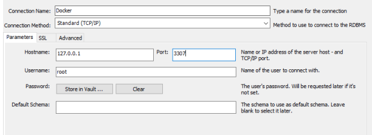
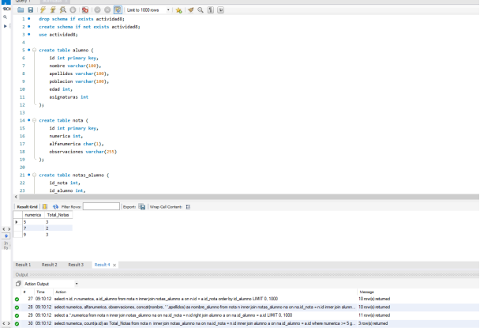

# Sistemas Informaticos

## Sprint 1

### Creación de un contenedor en Docker
Instalación de Docker.

Instalación de una imagen de MySQL para la creación de un container para su posterior uso en base de datos.

``` cmd
C:\Users\Usuario>docker pull mysql
``` 


``` cmd
C:\Users\Usuario>docker run -name some-mysql -p 3307:3306 -e MYSQL_ROOL_PASSWOD=my-secret-pw -d mysql:latest
``` 


 En este caso se habia de poner el container en el pueto 3307 como se puede comprobar en la imagen.



Comprobación del funcionamiento del container.




## Proyecto 2

### Creación de un contenedor en Docker
Instalación de una imagen de MongoDb para la creación de un container para su posterior uso en base de datos.

``` cmd
C:\Users\Usuario>docker pull mongo
``` 
``` cmd
C:\Users\Usuario>docker run --name some-mongo -d mongo:latest
``` 


